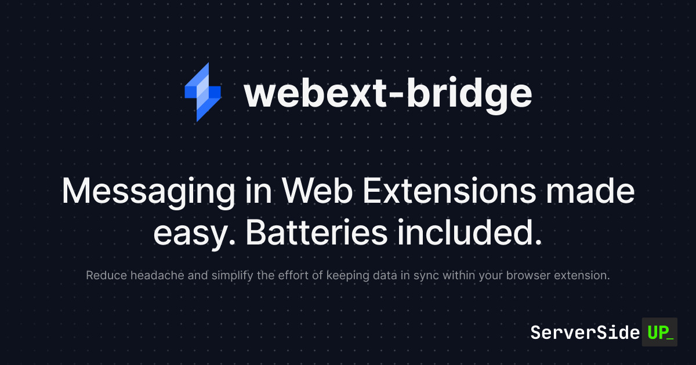

		

	
	
	
	 
	
	
  

> [!IMPORTANT]  
> **`webext-bridge` just joined the Server Side Up family of open source projects.** [Read the announcement →](https://github.com/serversideup/webext-bridge/discussions/74)

# Introduction
**Messaging in web extensions made easy. Batteries included.** Reduce headache and simplify the effort of keeping data in sync across different parts of your extension. `webext-bridge` is a tiny library that provides a simple and consistent API for sending and receiving messages between different parts of your web extension, such as `background`, `content-script`, `devtools`, `popup`, `options`, and `window` contexts.

## Resources
<!-- - **[Website](https://serversideup.net/open-source/webext-bridge/)** overview of the product.
- **[Docs](https://serversideup.net/open-source/webext-bridge/docs)** for a deep-dive on how to use the product. -->
- **[Discord](https://serversideup.net/discord)** for friendly support from the community and the team.
- **[GitHub](https://github.com/serversideup/webext-bridge)** for source code, bug reports, and project management.
- **[Get Professional Help](https://serversideup.net/professional-support)** - Get video + screen-sharing help directly from the core contributors.

## Contributing
As an open-source project, we strive for transparency and collaboration in our development process. We greatly appreciate any contributions members of our community can provide. Whether you're fixing bugs, proposing features, improving documentation, or spreading awareness - your involvement strengthens the project. Please review our [contribution guidelines](https://serversideup.net/open-source/webext-bridge/docs/community/contributing) and [code of conduct](./.github/code_of_conduct.md) to understand how we work together respectfully.

- **Bug Report**: If you're experiencing an issue while using these images, please [create an issue](https://github.com/serversideup/webext-bridge/issues/new/choose).
- **Feature Request**: Make this project better by [submitting a feature request](https://github.com/serversideup/webext-bridge/discussions/76).
- **Documentation**: Improve our documentation by [submitting a documentation change](./docs/README.md).
- **Community Support**: Help others on [GitHub Discussions](https://github.com/serversideup/webext-bridge/discussions) or [Discord](https://serversideup.net/discord).
- **Security Report**: Report critical security issues via [our responsible disclosure policy](https://www.notion.so/Responsible-Disclosure-Policy-421a6a3be1714d388ebbadba7eebbdc8).

Need help getting started? Join our Discord community and we'll help you out!

## Our Sponsors
All of our software is free an open to the world. None of this can be brought to you without the financial backing of our sponsors.

#### Individual Supporters
<!-- supporters -->&nbsp;&nbsp;&nbsp;&nbsp;&nbsp;&nbsp;<!-- supporters -->

## About Us
We're [Dan](https://twitter.com/danpastori) and [Jay](https://twitter.com/jaydrogers) - a two person team with a passion for open source products. We created [Server Side Up](https://serversideup.net) to help share what we learn.

| 
Dan Pastori
                  | 
Jay Rogers
                                 |
| ----------------------------- | ------------------------------------------ |
| 
 
                        | 
 
                                       |

### Find us at:

* **📖 [Blog](https://serversideup.net)** - Get the latest guides and free courses on all things web/mobile development.
* **🙋 [Community](https://community.serversideup.net)** - Get friendly help from our community members.
* **🤵‍♂️ [Get Professional Help](https://serversideup.net/professional-support)** - Get video + screen-sharing support from the core contributors.
* **💻 [GitHub](https://github.com/serversideup)** - Check out our other open source projects.
* **📫 [Newsletter](https://serversideup.net/subscribe)** - Skip the algorithms and get quality content right to your inbox.
* **🐥 [Twitter](https://twitter.com/serversideup)** - You can also follow [Dan](https://twitter.com/danpastori) and [Jay](https://twitter.com/jaydrogers).
* **❤️ [Sponsor Us](https://github.com/sponsors/serversideup)** - Please consider sponsoring us so we can create more helpful resources.

## Our products
If you appreciate this project, be sure to check out our other projects.

### 📚 Books
- **[The Ultimate Guide to Building APIs & SPAs](https://serversideup.net/ultimate-guide-to-building-apis-and-spas-with-laravel-and-nuxt3/)**: Build web & mobile apps from the same codebase.
- **[Building Multi-Platform Browser Extensions](https://serversideup.net/building-multi-platform-browser-extensions/)**: Ship extensions to all browsers from the same codebase.

### 🛠️ Software-as-a-Service
- **[Bugflow](https://bugflow.io/)**: Get visual bug reports directly in GitHub, GitLab, and more.
- **[SelfHost Pro](https://selfhostpro.com/)**: Connect Stripe or Lemonsqueezy to a private docker registry for self-hosted apps.

### 🌍 Open Source
- **[serversideup/php Docker Images](https://serversideup.net/open-source/docker-php/)**: PHP Docker images optimized for Laravel and running PHP applications in production.
- **[Financial Freedom](https://github.com/serversideup/financial-freedom)**: Open source alternative to Mint, YNAB, & Monarch Money.
- **[AmplitudeJS](https://521dimensions.com/open-source/amplitudejs)**: Open-source HTML5 & JavaScript Web Audio Library.
- **[webext-bridge](https://github.com/serversideup/webext-bridge)**: Messaging in web extensions made easy. Batteries included.
